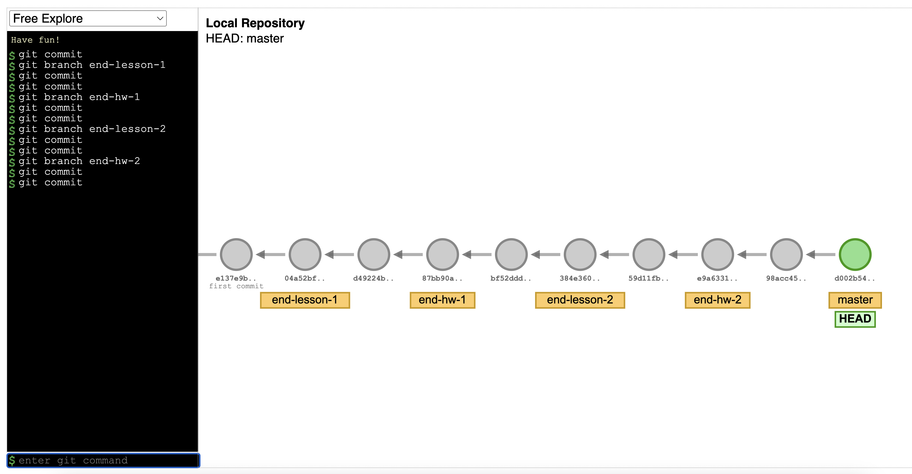

# Cloud Engineering for Python Developers


<!-- The branching structure of this repository looks like this:

 -->

```bash
# create and activate a virtual environment
python -m venv ./venv/
source ./venv/bin/activate

# create a scaffolded project
pip install cookiecutter
cookiecutter https://github.com/phitoduck/python-course-cookiecutter-v2.git

# dispose of the virtual environment
deactivate
rm -rf ./venv/
```

TODO:
- remove the boilerplate from the cookiecutter template. No cities.json stuff.
- simplify the project, e.g. don't need slow markers, ruff, test:quick, etc.
- Fix there are some lingering, explicit references to cookiecutter in the generated project

  ```python
    """
    Unit tests for cookiecutter.repo_name.

    This folder ideally has a parallel folder structure with the src/cookiecutter.package_import_name/ folder.

    In general, unit tests

    - should be fast and test a single function or class
    - should not depend on external resources (e.g., databases, network, etc.)
    """

  ```
