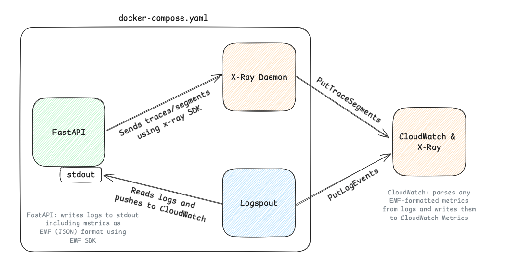

# Explore logs, traces, and metrics

## Getting started



1. Make sure you have an AWS profile with active credentials called `cloud-course`. 
    - It should have access to 
        1. create cloudwatch groups and streams
        2. push logs to cloudwatch
        3. push traces to x-ray

    ```bash
    aws configure sso --profile cloud-course

    # OR if you have already run this before ^^^
    aws sso login --profile cloud-course
    ```

2. Make sure the Docker daemon is running (i.e. open Docker Desktop)

3. Run the `docker-compose.yaml`

    ```bash
    # exports your cloud-course profile to a .env file and starts the containers
    bash start-compose.sh
    ```