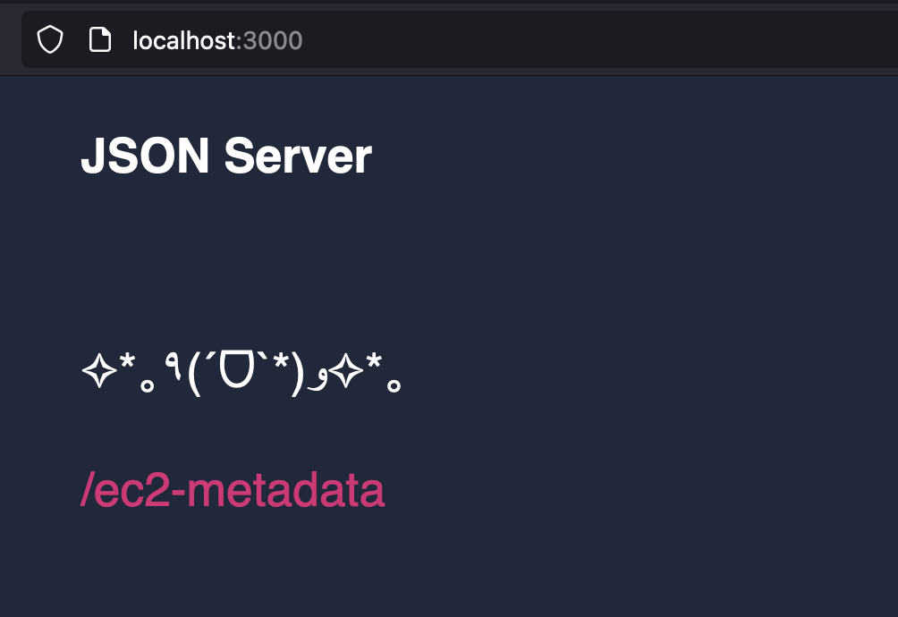

# Mocked EC2 Metadata Service

**TL;DR this mocks the EC2 metadata service so that the CloudWatch agent running locally thinks our local machine is an EC2 instance.**

The purpose of this service is pretty funny.

The CloudWatch agent is designed to run within AWS--either on EC2 instances or in the AWS Lambda compute environments.

When the CW agent starts up, it makes a call to a `/v1/metadata` endpoint on `localhost` to get the "EC2 instance metadata".

Basically the agent asks "which EC2 instance am I running on?". Naturally, our local machines are NOT EC2 isntances and so
there is no metadata endpoint running to respond to that request. 

This service mocks the EC2 metadata service so that the CloudWatch agent running locally thinks our local machine is an EC2 instance.