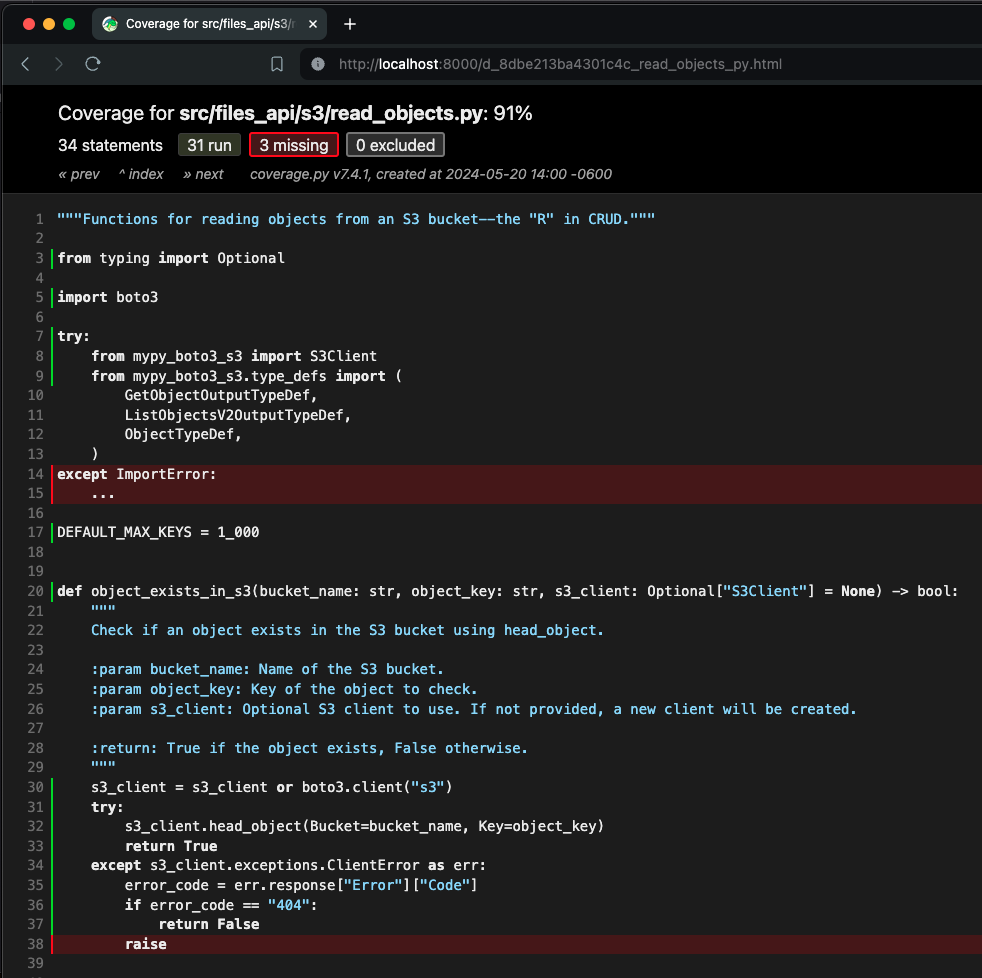
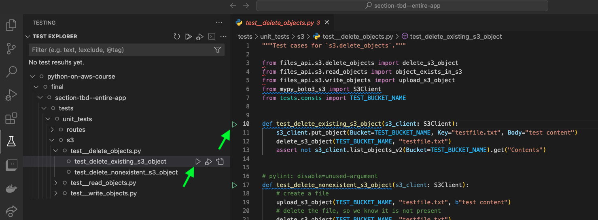

# Homework Assignment: Implement Tests for S3 Object Operations

## Objective

In this assignment, you will complete the implementation of unit tests for a set of functions that interact with AWS S3. This will help you understand how to use the `moto` library to mock AWS services and how to use pytest fixtures to set up your test environment.

## Project Structure

Here is the simplified structure of the project you will be working on:

```
<your-project>/
├── src
│   └── files_api
│       └── s3
│           ├── delete_objects.py        # fill in
│           ├── read_objects.py          # fill in
│           └── write_objects.py         # fill in
└── tests
    ├── fixtures
    │   └── s3_client.py                 # fill in
    └── unit_tests
        └── s3
            ├── test__delete_objects.py  # fill in
            ├── test__read_objects.py    # fill in
            └── test__write_objects.py   # fill in
```

Each of these files contains function stubs that you need to fill in with appropriate logic and test cases.

## Tasks

1. Fill in each of the stub files
2. Think of edge cases and write your own test cases for them

## Example
Here is an example of how you might implement a test function for `upload_s3_object` in `test__write_objects.py`:

### Implementation of `upload_s3_object`

```python
# src/files_api/s3/write_objects.py

from typing import Optional
import boto3

try:
    from mypy_boto3_s3 import S3Client
except ImportError:
    ...

def upload_s3_object(
    bucket_name: str,
    object_key: str,
    file_content: bytes,
    content_type: Optional[str] = None,
    s3_client: Optional["S3Client"] = None,
) -> None:
    content_type = content_type or "application/octet-stream"
    s3_client = s3_client or boto3.client("s3")
    s3_client.put_object(
        Bucket=bucket_name,
        Key=object_key,
        Body=file_content,
        ContentType=content_type,
    )
```

### Test for `upload_s3_object`

```python
# tests/unit_tests/s3/test__write_objects.py

from files_api.s3.write_objects import upload_s3_object
from mypy_boto3_s3 import S3Client
from tests.consts import TEST_BUCKET_NAME

def test_upload_s3_object(s3_client: S3Client):
    file_content = b"test content"
    upload_s3_object(TEST_BUCKET_NAME, "testfile.txt", file_content)
    response = s3_client.get_object(Bucket=TEST_BUCKET_NAME, Key="testfile.txt")
    assert response["Body"].read() == file_content
```

## Learning Goals

Gain experience

- Using the `moto` library to mock calls to AWS
- Using `moto` with pytest fixtures
- Safely testing scripts that interact with AWS

## Tips for testing

### Execute tests and view the test coverage

```bash
cd <your project root directory>

# execute the tests
bash run.sh run-tests

# view the test coverage in the browser
bash run.sh serve-coverage-report
```

Once the tests are run, the coverage report is calculated. Once you serve the coverage report, you can explore your
test coverage interactively in the browser at `localhost`.



### Execute tests and set step-debug breakpoints from VS Code



To set this up

1. Check your `.vscode/settings.json` file to ensure that the following settings are present:

```json
{
    // ...
    "python.testing.pytestEnabled": true,
    "python.testing.pytestPath": "pytest",
    "python.testing.pytestArgs": [
        "tests/"
    ]
    // ...
}
```

2. Be sure to have a virtual environment created with all of the test dependencies installed
3. Configure VS Code with `Python: Select Interpreter` to use the virtual environment

If you have trouble, VS Code can show you the error logs. The issue typically comes from the underlying
`pytest ./tests/` command failing for some reason. The logs are helpful for identifying the cause of this.

